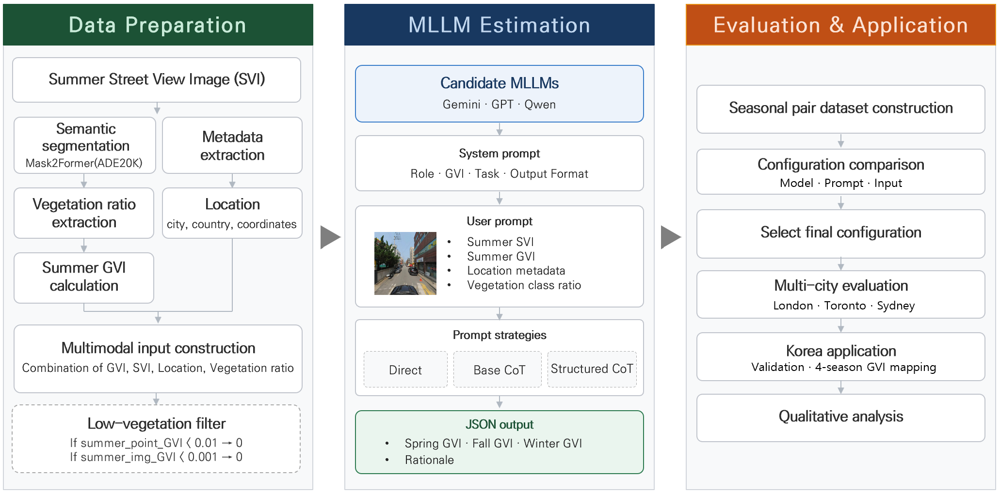

# Seasonal GVI Estimation Without Seasonal Imagery: A Zero-Shot MLLM Framework for Urban Greenery Assessment
ACM SIGSPATIAL 2026 Application Track

---

## Application

**GVI (Green View Index)** is the share of vegetation pixels in a street-level image, representing greenery visibility from a pedestrian viewpoint (0 = no vegetation, 1 = fully vegetated).


*Seasonal GVI map of Anyang, South Korea — spring / summer / fall / winter*

- **Study area:** Anyang City, South Korea — a mid-sized city where street-view imagery is captured only once a year, exclusively in summer
- **Input imagery:** 38,640 street-view images collected across 9,660 road points at 30 m intervals in **August 2023**
- **Summer (observed):** GVI directly computed from August 2023 street-view imagery via semantic segmentation
- **Spring / Fall / Winter (predicted):** GVI estimated by the proposed zero-shot MLLM framework (Gemini 2.5 Flash, Structured CoT, GVI+IMG+LOC+VEG) using summer imagery alone as input
  
🗺️ Interactive map: [ArcGIS Experience Builder](https://experience.arcgis.com/experience/1075add9d1384f1d861f949a38bc0e9c)


## Framework Overview



We propose a zero-shot seasonal GVI estimation framework that estimates spring, fall, and winter GVI from a single summer street-view image, addressing the lack of seasonal SVI.

We compared prompting strategies and input-data combinations across Gemini 2.5 Flash, GPT-4o, GPT-4o mini, Qwen3-VL-235B-Instruct, and Qwen3-VL-8B-Instruct, evaluated the selected framework, and applied it to a real-world setting with limited seasonal street-view data.

1. Collect Google Street View summer images — `01_gsv_collection.ipynb`
2. Compute summer GVI via Mask2Former segmentation — `02_segmentation_gvi.ipynb`
3. Estimate seasonal GVI using Gemini Batch API — `03_inference_batch.ipynb`

## Repository Structure

```
├── notebooks/
│   ├── 01_gsv_collection.ipynb     OSM sampling → metadata → image download
│   ├── 02_segmentation_gvi.ipynb   Mask2Former segmentation + summer GVI
│   └── 03_inference_batch.ipynb    Gemini Batch API inference + point aggregation
├── prompts/
│   ├── system_prompt_direct.txt
│   ├── system_prompt_base_cot.txt
│   ├── system_prompt_structured_cot.txt
│   └── user_prompt_example.md
├── data/sample/
│   └── metadata_sample.csv
└── assets/
    ├── anyang_seasonal_gvi.gif
    └── framework.png
```

## Requirements

Python 3.10+

```bash
pip install streetview geopandas shapely requests tqdm \
            transformers torch torchvision Pillow \
            "google-genai>=1.34.0" pandas
```

- Google Maps API key required for `01_gsv_collection.ipynb`
- Gemini API key required for `03_inference_batch.ipynb`

## Usage

The notebooks run in sequence; each step's output feeds the next.

**Step 1.** `notebooks/01_gsv_collection.ipynb` — set `SHP_PATH` and `GOOGLE_MAPS_API_KEY` in the CONFIG cell. Downloads 4 directional summer images per point and writes `results/points.csv`.

**Step 2.** `notebooks/02_segmentation_gvi.ipynb` — set `IMAGE_DIR` (and optionally `POINTS_CSV` to the `points.csv` from Step 1). Writes per-image summer GVI to `results/segmentation_results.csv`.

**Step 3.** `notebooks/03_inference_batch.ipynb` — set `GEMINI_API_KEY` and `INPUT_CSV` (= `results/segmentation_results.csv`, or the provided sample). Per-image predictions are averaged over the 4 directional images at each point to produce `results/point_result.csv`.

A sample is included at `data/sample/metadata_sample.csv`.  
GSV images are not included (Google Terms of Service).

## Outputs

Written to `results/` (gitignored):

| File | From | Description |
|------|------|-------------|
| `points.csv` | 01 | Sampled points: `point_id, lat, lon, city, country` |
| `segmentation_results.csv` | 02 | Per-image summer GVI + vegetation ratios (input to 03) |
| `seasonal_gvi_results.csv` | 03 | Per-image seasonal GVI predictions (0–100) |
| `point_result.csv` | 03 | Final point-level GVI: summer + predicted spring/fall/winter (0–1), averaged over the 4 directional images |

## Data

`data/sample/metadata_sample.csv` — 9 rows from London, Sydney, and Toronto.
The sample is single-view (one row per point, `heading` 0); a full `01`→`02` run
produces 4 directional rows per point, which `03` averages to point level.

| Column | Description |
|--------|-------------|
| `image_id` | Image filename stem (`summer_{point_id}_{heading}`); batch key |
| `point_id` | Sampling point / panorama ID (groups the 4 directional images) |
| `heading` | View direction (0 / 90 / 180 / 270) |
| `filepath` | Local image path |
| `lat`, `lon` | Coordinates |
| `city`, `country` | Location |
| `GVI` | Summer GVI (0–1) |
| `class_4_tree` … `class_72_palm` | Vegetation class pixel ratios |

## Prompts

| File | Strategy | Selected |
|------|----------|:--------:|
| `system_prompt_direct.txt` | Direct | |
| `system_prompt_base_cot.txt` | Base CoT | |
| `system_prompt_structured_cot.txt` | Structured CoT | ✓ |

Set `PROMPT_STRATEGY` in the `03_inference_batch.ipynb` CONFIG cell.
